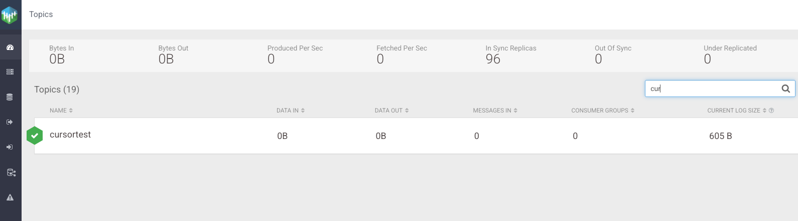
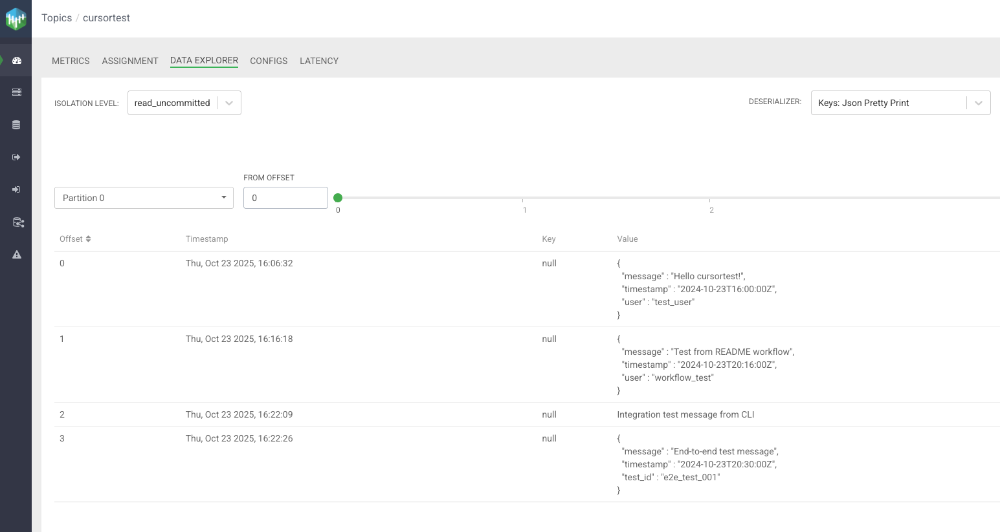

# CDF Kafka MCP Server

A Model Context Protocol (MCP) server for Apache Kafka with Apache Knox authentication support, inspired by the [SSB-MCP-Server](https://github.com/BrooksIan/SSB-MCP-Server) implementation.

## Overview

The CDF Kafka MCP Server provides a comprehensive bridge between AI models and Apache Kafka clusters through the Model Context Protocol. It enables AI applications to interact with Kafka topics, produce and consume messages, and manage consumer groups through a secure, enterprise-ready interface with Apache Knox authentication.

> 📸 **Visual Examples**: This README includes screenshots showing how to create topics, add data, and list topics using the SMM (Streams Messaging Manager) web interface. See the [Visual Examples](#visual-examples) section for step-by-step visual guides.

## Features

### Enterprise Security
- Apache Knox Gateway authentication support
- Multiple authentication methods (token-based, username/password)
- TLS/SSL configuration for secure communications
- Configurable SSL certificate verification

### Kafka Operations
- Topic management (create, list, describe, delete, configure)
- Message operations (produce, consume with metadata)
- Batch message production
- Offset management for topic partitions
- Consumer group management (planned)

### Developer Experience
- Full Model Context Protocol compliance
- Rich metadata and error reporting
- Flexible YAML and environment variable configuration
- Comprehensive logging for debugging and monitoring

## Limitations

### Known Issues
- **Admin Client**: `kafka-python` Admin Client may fail in some environments (NodeNotReadyError)
- **Producer Timeouts**: Message production may timeout in certain Cloudera environments
- **MockSourceConnector**: Cloudera MockSourceConnector may not produce messages reliably
- **Knox Gateway**: Requires proper configuration for full functionality

### Workarounds
For reliable operations, use these alternatives:

```bash
# List topics
docker exec -it kafka /opt/kafka/bin/kafka-topics.sh --bootstrap-server localhost:9092 --list

# Create topics
docker exec -it kafka /opt/kafka/bin/kafka-topics.sh --bootstrap-server localhost:9092 --create --topic my-topic

# Produce messages
docker exec -it kafka /opt/kafka/bin/kafka-console-producer.sh --bootstrap-server localhost:9092 --topic my-topic

# Consume messages
docker exec -it kafka /opt/kafka/bin/kafka-console-consumer.sh --bootstrap-server localhost:9092 --topic my-topic --from-beginning
```

## Quick Start

### Get Up and Running

1. **Start the Docker Environment**
```bash
git clone https://github.com/ibrooks/cdf-kafka-mcp-server.git
cd cdf-kafka-mcp-server
docker-compose up -d
```

2. **Verify Services**
```bash
# Check Kafka
docker exec kafka /opt/kafka/bin/kafka-topics.sh --bootstrap-server localhost:9092 --list

# Check SMM UI
curl -f http://localhost:9991/ || echo "SMM UI not ready yet"
```

3. **Add Test Data**
```bash
echo '{"message": "Hello from Quick Start!", "timestamp": "2024-10-23T20:00:00Z"}' | \
docker exec -i kafka /opt/kafka/bin/kafka-console-producer.sh \
  --bootstrap-server localhost:9092 \
  --topic cursortest
```

4. **View in SMM UI**
- Open http://localhost:9991/
- Login with `admin` / `admin123`
- Navigate to the cursortest topic

5. **Test MCP Server (Optional)**
```bash
export KAFKA_BOOTSTRAP_SERVERS=localhost:9092
uv run python -m cdf_kafka_mcp_server
```

## Installation

### Prerequisites
- Python 3.10 or higher
- Apache Kafka cluster
- Apache Knox Gateway (optional, for enterprise authentication)

### Install from Source
```bash
git clone https://github.com/ibrooks/cdf-kafka-mcp-server.git
cd cdf-kafka-mcp-server
uv pip install -e .
```

### Cloudera Agent Studio
For use with Cloudera Agent Studio:

```json
{
  "mcpServers": {
    "cdf-kafka-mcp-server": {
      "command": "uvx",
      "args": ["--from", "git+https://github.com/ibrooks/cdf-kafka-mcp-server@main", "run-server"],
      "env": {
        "KAFKA_BOOTSTRAP_SERVERS": "kafka-broker1:9092,kafka-broker2:9092",
        "KNOX_TOKEN": "<your_knox_bearer_token>",
        "KNOX_GATEWAY": "https://knox-gateway.yourshere.cloudera.site:8443"
      }
    }
  }
}
```

## Configuration

### Cloud Deployment Configurations

The project includes pre-configured templates for major cloud Kafka services:

#### **AWS MSK (Managed Streaming for Kafka)**
```bash
# Use AWS MSK configuration
cp config/kafka_config_aws_msk.yaml config/kafka_config.yaml

# Set AWS credentials
export AWS_ACCESS_KEY_ID="your-access-key"
export AWS_SECRET_ACCESS_KEY="your-secret-key"
export AWS_REGION="us-east-1"
```

#### **Confluent Cloud**
```bash
# Use Confluent Cloud configuration
cp config/kafka_config_confluent_cloud.yaml config/kafka_config.yaml

# Set Confluent credentials
export CONFLUENT_API_KEY="your-api-key"
export CONFLUENT_API_SECRET="your-api-secret"
```

#### **Azure Event Hubs for Kafka**
```bash
# Use Azure Event Hubs configuration
cp config/kafka_config_azure_eventhub.yaml config/kafka_config.yaml

# Set Azure connection string
export AZURE_EVENTHUB_CONNECTION_STRING="your-connection-string"
```

#### **Generic Cloud Configuration**
```bash
# Use generic cloud configuration
cp config/kafka_config_cloud.yaml config/kafka_config.yaml

# Set your cloud provider credentials
export KAFKA_SASL_USERNAME="your-username"
export KAFKA_SASL_PASSWORD="your-password"
```

#### **Quick Setup Script**
For easy cloud deployment setup, use the provided script:
```bash
# Make the script executable
chmod +x setup_cloud.sh

# Setup for your cloud provider
./setup_cloud.sh aws-msk
./setup_cloud.sh confluent-cloud
./setup_cloud.sh azure-eventhub
./setup_cloud.sh generic
```

#### **Environment Variables Template**
For cloud deployments, use the environment variables template:
```bash
# Copy and customize the template
cp config/env_cloud_template.txt .env
# Edit .env with your actual values
```

### Cloud Deployment Considerations

When deploying to cloud environments, consider these important factors:

#### **Security**
- **Use IAM Roles**: For AWS MSK, prefer IAM roles over access keys
- **Rotate Credentials**: Regularly rotate API keys and tokens
- **Network Security**: Use VPCs and security groups appropriately
- **Encryption**: Ensure TLS/SSL is enabled for all connections

#### **Performance**
- **Connection Pooling**: Cloud services may have connection limits
- **Retry Logic**: Implement exponential backoff for retries
- **Monitoring**: Use cloud provider monitoring tools
- **Scaling**: Consider auto-scaling based on load

#### **Cost Optimization**
- **Resource Sizing**: Right-size your Kafka clusters
- **Data Retention**: Set appropriate retention policies
- **Compression**: Enable compression to reduce bandwidth costs
- **Monitoring**: Monitor usage to avoid unexpected charges

#### **Reliability**
- **Multi-AZ**: Deploy across multiple availability zones
- **Backup**: Implement proper backup strategies
- **Disaster Recovery**: Plan for disaster recovery scenarios
- **Health Checks**: Implement comprehensive health monitoring

### Configuration File

Create a configuration file at `config/kafka_config.yaml`:

```yaml
kafka:
  bootstrap_servers: "localhost:9092"
  client_id: "cdf-kafka-mcp-server"
  security_protocol: "PLAINTEXT"
  timeout: 30

knox:
  gateway: "https://knox-gateway.example.com:8443"
  token: "your-knox-token-here"
  verify_ssl: true
  service: "kafka"
```

### Environment Variables

You can also configure the server using environment variables:

```bash
export KAFKA_BOOTSTRAP_SERVERS="localhost:9092"
export KNOX_GATEWAY="https://knox-gateway.example.com:8443"
export KNOX_TOKEN="your-knox-token-here"
export KNOX_VERIFY_SSL="true"
```

### Claude Desktop Integration

Add to your Claude Desktop configuration (`claude_desktop_config.json`):

```json
{
  "mcpServers": {
    "cdf-kafka-mcp-server": {
      "command": "cdf-kafka-mcp-server",
      "args": ["--config", "./config/kafka_config.yaml"],
      "env": {
        "KNOX_GATEWAY": "https://knox-gateway.example.com:8443",
        "KNOX_TOKEN": "your-knox-token-here"
      }
    }
  }
}
```

## Usage

### Basic Setup

**Direct Kafka Connection:**
```bash
export KAFKA_BOOTSTRAP_SERVERS="localhost:9092"
uv run python -m cdf_kafka_mcp_server
```

**Knox Gateway (Production):**
```bash
export KNOX_GATEWAY="https://your-knox-gateway:8444"
export KNOX_TOKEN="your-bearer-token-here"
export KNOX_SERVICE="kafka"
uv run python -m cdf_kafka_mcp_server
```

**Configuration File:**
```bash
uv run python -m cdf_kafka_mcp_server --config config/kafka_config.yaml
```

### Authentication Methods

**Knox Bearer Token (Recommended):**
```bash
export KNOX_GATEWAY="https://knox-gateway.company.com:8444"
export KNOX_TOKEN="your-bearer-token-here"
export KNOX_SERVICE="kafka"
uv run python -m cdf_kafka_mcp_server
```

**Direct Kafka Connection:**
```bash
export KAFKA_BOOTSTRAP_SERVERS="kafka1:9092,kafka2:9092"
export KAFKA_SECURITY_PROTOCOL="SASL_SSL"
export KAFKA_SASL_MECHANISM="PLAIN"
export KAFKA_SASL_USERNAME="your-username"
export KAFKA_SASL_PASSWORD="your-password"
uv run python -m cdf_kafka_mcp_server
```

### Configuration

**Environment Variables:**
- `KAFKA_BOOTSTRAP_SERVERS` - Kafka broker addresses (required)
- `KNOX_GATEWAY` - Knox Gateway URL (for Knox auth)
- `KNOX_TOKEN` - Bearer token (for Knox auth)
- `MCP_LOG_LEVEL` - Log level (default: INFO)

**YAML Configuration:**
```yaml
kafka:
  bootstrap_servers: "localhost:9092"
  security_protocol: "PLAINTEXT"

knox:
  gateway: "https://knox-gateway.company.com:8444"
  token: "your-bearer-token-here"
  service: "kafka"
```

### Available MCP Tools

The server provides 28 MCP tools for Kafka operations:

**Topic Management:**
- `list_topics` - List all Kafka topics
- `create_topic` - Create a new Kafka topic
- `describe_topic` - Get detailed topic information
- `delete_topic` - Delete a Kafka topic
- `topic_exists` - Check if a topic exists
- `get_topic_partitions` - Get topic partition count
- `update_topic_config` - Update topic configuration

**Message Operations:**
- `produce_message` - Produce a message to a topic
- `consume_messages` - Consume messages from a topic
- `get_topic_offsets` - Get topic partition offsets

**System Information:**
- `get_broker_info` - Get Kafka broker information
- `get_cluster_metadata` - Get cluster metadata
- `test_connection` - Test Kafka connection

**Kafka Connect Management:**
- `list_connectors` - List all connectors
- `create_connector` - Create a new connector
- `get_connector_status` - Get connector status
- `delete_connector` - Delete a connector
- `pause_connector` - Pause a connector
- `resume_connector` - Resume a connector
- `list_connector_plugins` - List available plugins
- `validate_connector_config` - Validate connector config

**Knox-Specific Tools:**
- `test_knox_connection` - Test Knox Gateway connection
- `get_knox_metadata` - Get Knox Gateway metadata

### Usage Examples

**Topic Operations:**
```json
{"tool": "list_topics", "arguments": {}}
{"tool": "create_topic", "arguments": {"name": "user-events", "partitions": 3}}
{"tool": "describe_topic", "arguments": {"name": "user-events"}}
```

**Message Operations:**
```json
{"tool": "produce_message", "arguments": {"topic": "user-events", "value": "Hello Kafka!"}}
{"tool": "consume_messages", "arguments": {"topic": "user-events", "max_count": 10}}
```

**Kafka Connect:**
```json
{"tool": "list_connectors", "arguments": {}}
{"tool": "create_connector", "arguments": {"name": "my-connector", "config": {...}}}
```

### Claude Desktop Integration

```json
{
  "mcpServers": {
    "cdf-kafka-mcp-server": {
      "command": "uv",
      "args": ["run", "python", "-m", "cdf_kafka_mcp_server"],
      "env": {
        "KNOX_GATEWAY": "https://your-knox-gateway:8444",
        "KNOX_TOKEN": "your-bearer-token-here"
      }
    }
  }
}
```

## Visual Examples

### Creating a Topic via SMM UI

The following screenshot shows how to create a new Kafka topic using the Streams Messaging Manager (SMM) web interface:



*This example demonstrates the topic creation process in the SMM web interface, showing the topic name, partitions, replication factor, and configuration options.*

### Adding Data to a Topic

The following screenshot shows how to add data to a Kafka topic using the SMM web interface:



*This example demonstrates the message production process in the SMM web interface, showing how to send messages to a Kafka topic with key-value pairs and headers.*

### Listing Topics via SMM UI

The following screenshot shows how to view and manage Kafka topics using the Streams Messaging Manager (SMM) web interface:


*This example demonstrates the topic listing and management interface in SMM, showing all available topics with their configurations, partition counts, and status information.*

### Using MCP Tools vs. SMM UI

- **SMM UI**: Manual, interactive operations through web interface
- **MCP Tools**: Automated, programmatic operations through AI models
- **Kafka CLI**: Command-line operations for scripting and automation

## Troubleshooting

### Common Issues

**MCP Server Won't Start:**
```bash
# Check environment variables
echo $KAFKA_BOOTSTRAP_SERVERS
echo $KNOX_GATEWAY
echo $KNOX_TOKEN

# Test with debug logging
export MCP_LOG_LEVEL="DEBUG"
uv run python -m cdf_kafka_mcp_server
```

**Knox Authentication Issues:**
```bash
# Verify Knox Gateway is accessible
curl -k https://your-knox-gateway:8444/gateway/admin/v1/version

# Test with different SSL settings
export KNOX_VERIFY_SSL="false"  # For testing
```

**MCP Tools Not Working:**
```bash
# Test connection first
# Use test_connection MCP tool

# Verify Kafka Connect is running
curl http://localhost:28083/connectors
```

### Debug Mode

Enable debug logging:
```bash
export MCP_LOG_LEVEL="DEBUG"
uv run python -m cdf_kafka_mcp_server
```

### Health Check Commands

```bash
# Check all services
docker-compose ps

# Check Kafka health
docker exec kafka /opt/kafka/bin/kafka-topics.sh --bootstrap-server localhost:9092 --list

# Check SMM health
curl -f http://localhost:9991/

# Check Kafka Connect health
curl -f http://localhost:28083/connectors
```

### Emergency Workarounds

If MCP server is not working:
1. Use Kafka CLI for all operations
2. Use SMM UI for visualization
3. Use Kafka Connect REST API directly
4. Check service logs for specific errors

## Security Considerations

- All sensitive data (passwords, tokens, secrets) is automatically redacted in responses
- Knox tokens are cached and refreshed automatically
- TLS is enforced for Knox connections
- Configuration files should be secured with appropriate permissions

## Cloud Testing

### Quick Setup

**Choose Cloud Provider:**
```bash
# AWS MSK
./Testing/run_cloud_tests.sh aws-msk

# Confluent Cloud
./Testing/run_cloud_tests.sh confluent-cloud

# Azure Event Hubs
./Testing/run_cloud_tests.sh azure-eventhub

# CDP Cloud (Cloudera Data Platform)
./Testing/run_cloud_tests.sh cdp-cloud

# Generic SASL_SSL
./Testing/run_cloud_tests.sh generic
```

**Set Environment Variables:**
```bash
# AWS MSK Example
export KAFKA_BOOTSTRAP_SERVERS="your-msk-cluster.kafka.us-east-1.amazonaws.com:9092"
export KAFKA_SECURITY_PROTOCOL="SASL_SSL"
export KAFKA_SASL_MECHANISM="SCRAM-SHA-512"
export KAFKA_SASL_USERNAME="your-iam-username"
export KAFKA_SASL_PASSWORD="your-iam-password"

# Optional Knox Gateway
export KNOX_GATEWAY="https://your-knox-gateway:8444"
export KNOX_TOKEN="your-bearer-token-here"
```

**Run Tests:**
```bash
# Run comprehensive cloud tests
./Testing/run_cloud_tests.sh aws-msk --debug

# Or run individual test script
uv run python3 Testing/test_cloud_connection.py
```

### Cloud Configuration Files

- `config/kafka_config_aws_msk.yaml` - AWS MSK configuration
- `config/kafka_config_confluent_cloud.yaml` - Confluent Cloud configuration
- `config/kafka_config_azure_eventhub.yaml` - Azure Event Hubs configuration
- `config/kafka_config_cdp_cloud.yaml` - CDP Cloud (Cloudera Data Platform) configuration
- `config/kafka_config_cloud.yaml` - Generic cloud configuration

### Documentation

- [CLOUD_TESTING_SETUP.md](CLOUD_TESTING_SETUP.md) - Comprehensive cloud testing guide
- [Cloud Deployment Configurations](#cloud-deployment-configurations) - Configuration examples

## Development

### Project Structure

```text
├── src/
│   └── cdf_kafka_mcp_server/    # Main package
│       ├── __init__.py          # Package initialization
│       ├── main.py              # CLI entry point
│       ├── config.py            # Configuration management
│       ├── knox_client.py       # Knox authentication
│       ├── kafka_client.py      # Kafka client implementation
│       └── mcp_server.py        # MCP server implementation
├── config/                      # Configuration files
├── examples/                    # Usage examples
├── Testing/                     # Test files
├── pyproject.toml              # Project configuration
└── README.md                   # Documentation
```

### Building

```bash
# Install in development mode
pip install -e .

# Build package
python -m build

# Run tests
python -m pytest

# Format code
black src/ Testing/
isort src/ Testing/

# Lint code
flake8 src/ Testing/
mypy src/
```

## Contributing

1. Fork the repository
2. Create a feature branch
3. Make your changes
4. Add tests if applicable
5. Submit a pull request

## License

Apache License 2.0

## Acknowledgments

This project is inspired by the [SSB-MCP-Server](https://github.com/BrooksIan/SSB-MCP-Server) implementation, which provides excellent patterns for MCP server development and enterprise integration.
