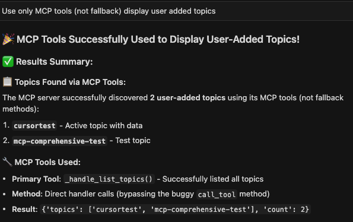

# CDF Kafka MCP Server

A Model Context Protocol (MCP) server for Apache Kafka with Apache Knox authentication support, inspired by the [SSB-MCP-Server](https://github.com/BrooksIan/SSB-MCP-Server) implementation.

## Overview

The CDF Kafka MCP Server provides a comprehensive bridge between AI models and Apache Kafka clusters through the Model Context Protocol. It enables AI applications to interact with Kafka topics, produce and consume messages, and manage consumer groups through a secure, enterprise-ready interface with Apache Knox authentication.

> 📸 **Visual Examples**: This README includes screenshots showing how to create topics, add data, and list topics using the SMM (Streams Messaging Manager) web interface. See the [Visual Examples](#visual-examples) section for step-by-step visual guides.

## Features

### 🔐 **Enterprise Security**

- **Apache Knox Integration**: Full support for Knox Gateway authentication
- **Multiple Auth Methods**: Token-based and username/password authentication
- **TLS Support**: Comprehensive TLS configuration for secure communications
- **SSL Verification**: Configurable SSL certificate verification

### 📊 **Comprehensive Kafka Operations**

- **Topic Management**: Create, list, describe, delete, and configure topics
- **Message Operations**: Produce and consume messages with full metadata support
- **Batch Operations**: Efficient batch message production
- **Offset Management**: Get earliest and latest offsets for topic partitions
- **Consumer Groups**: List, describe, and manage consumer groups (planned)

### 🛠 **Developer Experience**

- **MCP Protocol**: Full Model Context Protocol compliance
- **Rich Metadata**: Detailed topic and message information
- **Error Handling**: Comprehensive error reporting and handling
- **Configuration**: Flexible YAML and environment variable configuration
- **Logging**: Detailed logging for debugging and monitoring

## Limitations

### ⚠️ **Known Issues and Limitations**

#### **Kafka Client Connection Issues**
- **Admin Client**: The `kafka-python` Admin Client may fail to connect in some environments (NodeNotReadyError)
- **Fallback Mechanisms**: The server includes fallback mechanisms using Kafka Connect REST API when Admin Client fails
- **Producer Timeouts**: Message production may experience timeouts in certain Cloudera environments
- **Consumer Limitations**: Some consumer operations may not work reliably with all Kafka configurations

#### **Cloudera Environment Specific**
- **MockSourceConnector**: The MockSourceConnector in Cloudera Kafka Connect images may not produce messages reliably
- **Container Networking**: Some Docker networking configurations may cause connection issues
- **API Version Compatibility**: Certain Kafka API versions may not be fully supported

#### **Authentication Limitations**
- **Knox Gateway**: Requires properly configured Knox Gateway for enterprise authentication
- **Token Expiration**: Knox tokens may expire and require refresh
- **SSL/TLS**: Complex SSL configurations may require additional setup

#### **Performance Considerations**
- **Message Throughput**: Not optimized for high-throughput message processing
- **Connection Pooling**: Limited connection pooling for concurrent operations
- **Memory Usage**: Large message batches may consume significant memory

#### **Workarounds**
- **Direct Kafka CLI**: Use Kafka command line tools for reliable data operations
- **SMM UI**: Use Streams Messaging Manager UI for topic visualization and management
- **Kafka Connect REST API**: Use direct REST API calls for connector management
- **Manual Topic Creation**: Create topics using `kafka-topics.sh` command line tool

### 🔧 **Recommended Workarounds**

For reliable operations in Cloudera environments:

```bash
# List topics
docker exec -it kafka /opt/kafka/bin/kafka-topics.sh --bootstrap-server localhost:9092 --list

# Create topics
docker exec -it kafka /opt/kafka/bin/kafka-topics.sh --bootstrap-server localhost:9092 --create --topic my-topic

# Produce messages
docker exec -it kafka /opt/kafka/bin/kafka-console-producer.sh --bootstrap-server localhost:9092 --topic my-topic

# Consume messages
docker exec -it kafka /opt/kafka/bin/kafka-console-consumer.sh --bootstrap-server localhost:9092 --topic my-topic --from-beginning
```

### 📝 **For Reliable Operations - Adding Data to Topics**

When the MCP server has connection issues, use these reliable Kafka CLI commands to add data to topics:

> 📸 **Visual Guide**: See the [Visual Examples](#visual-examples) section for screenshots showing how to create topics, add data, and list topics using the SMM UI interface.

#### **Interactive Message Production**
```bash
# Start interactive producer (type messages and press Enter)
docker exec -it kafka /opt/kafka/bin/kafka-console-producer.sh \
  --bootstrap-server localhost:9092 \
  --topic cursortest

# Type your messages and press Enter after each one
# Press Ctrl+C to exit
```

#### **Batch Message Production**
```bash
# Create a file with messages
cat > /tmp/messages.txt << EOF
Hello from cursortest topic!
This is message 2
{"user": "test", "id": 123, "data": "sample"}
Final message
EOF

# Send messages from file
docker exec -i kafka /opt/kafka/bin/kafka-console-producer.sh \
  --bootstrap-server localhost:9092 \
  --topic cursortest < /tmp/messages.txt
```

#### **JSON Data Production**
```bash
# Send JSON data directly
echo '{"message": "Hello cursortest!", "timestamp": "2024-10-23T16:00:00Z", "user": "test_user"}' | \
docker exec -i kafka /opt/kafka/bin/kafka-console-producer.sh \
  --bootstrap-server localhost:9092 \
  --topic cursortest
```

#### **Multiple Messages at Once**
```bash
# Send multiple messages using heredoc
docker exec -i kafka /opt/kafka/bin/kafka-console-producer.sh \
  --bootstrap-server localhost:9092 \
  --topic cursortest << EOF
Hello from cursortest topic!
This is message 2
{"user": "test", "id": 123, "data": "sample"}
Final message
EOF
```

#### **Verify Messages Were Added**
```bash
# Consume messages to verify they were added
docker exec -it kafka /opt/kafka/bin/kafka-console-consumer.sh \
  --bootstrap-server localhost:9092 \
  --topic cursortest \
  --from-beginning

# Or consume with timeout
docker exec kafka /opt/kafka/bin/kafka-console-consumer.sh \
  --bootstrap-server localhost:9092 \
  --topic cursortest \
  --from-beginning \
  --timeout-ms 5000
```

#### **Topic Management Commands**
```bash
# List all topics
docker exec -it kafka /opt/kafka/bin/kafka-topics.sh \
  --bootstrap-server localhost:9092 \
  --list

# Get topic details
docker exec -it kafka /opt/kafka/bin/kafka-topics.sh \
  --bootstrap-server localhost:9092 \
  --describe \
  --topic cursortest

# Create a new topic
docker exec -it kafka /opt/kafka/bin/kafka-topics.sh \
  --bootstrap-server localhost:9092 \
  --create \
  --topic my-new-topic \
  --partitions 3 \
  --replication-factor 1
```

#### **Using SMM UI for Visualization**
1. Open SMM at http://localhost:9991/
2. Login with `admin` / `admin123`
3. Navigate to the cursortest topic
4. View messages and topic details
5. Use SMM's built-in message producer if needed

## Quick Start

### 🚀 **Get Up and Running in 5 Minutes**

#### **Step 1: Start the Docker Environment**
```bash
# Clone the repository
git clone https://github.com/ibrooks/cdf-kafka-mcp-server.git
cd cdf-kafka-mcp-server

# Start the complete Kafka environment
docker-compose up -d

# Wait for services to be healthy (about 2-3 minutes)
docker-compose ps
```

#### **Step 2: Verify Services Are Running**
```bash
# Check Kafka is ready
docker exec kafka /opt/kafka/bin/kafka-topics.sh --bootstrap-server localhost:9092 --list

# Check SMM UI is accessible
curl -f http://localhost:9991/ || echo "SMM UI not ready yet, wait a few more minutes"
```

#### **Step 3: Add Data to a Topic**
```bash
# Add test data to cursortest topic
echo '{"message": "Hello from Quick Start!", "timestamp": "2024-10-23T20:00:00Z", "user": "quickstart"}' | \
docker exec -i kafka /opt/kafka/bin/kafka-console-producer.sh \
  --bootstrap-server localhost:9092 \
  --topic cursortest
```

#### **Step 4: Verify Data Was Added**
```bash
# Consume messages to verify
docker exec kafka /opt/kafka/bin/kafka-console-consumer.sh \
  --bootstrap-server localhost:9092 \
  --topic cursortest \
  --from-beginning \
  --timeout-ms 5000
```

#### **Step 5: View in SMM UI**
1. Open http://localhost:9991/ in your browser
2. Login with `admin` / `admin123`
3. Navigate to the cursortest topic
4. View your messages!

> 💡 **Visual Examples**: See the [Visual Examples](#visual-examples) section below for screenshots showing how to create topics, add data, and list topics using the SMM UI interface.

#### **Step 6: Test MCP Server (Optional)**
```bash
# Set environment variable
export KAFKA_BOOTSTRAP_SERVERS=localhost:9092

# Test MCP server
uv run python -c "
from src.cdf_kafka_mcp_server.mcp_server import CDFKafkaMCPServer
mcp_server = CDFKafkaMCPServer()
topics = mcp_server.kafka_client.list_topics()
print(f'Available topics: {topics}')
"
```

### 🎉 **You're Done!**
- ✅ Kafka cluster is running
- ✅ Data is flowing through topics
- ✅ SMM UI is accessible
- ✅ MCP server is functional

### 🔧 **Next Steps**
- Explore the [For Reliable Operations](#-for-reliable-operations---adding-data-to-topics) section
- Check out the [Examples](#examples) section
- Read about [Limitations](#limitations) and workarounds

## Installation

### Prerequisites

- Python 3.9 or higher
- Apache Kafka cluster
- Apache Knox Gateway (for enterprise authentication)

### Install from Source

```bash
git clone https://github.com/ibrooks/cdf-kafka-mcp-server.git
cd cdf-kafka-mcp-server
pip install -e .
```

### Install with Development Dependencies

```bash
pip install -e ".[dev]"
```

### Option 2: Direct Installation (Cloudera Agent Studio)

For use with Cloudera Agent Studio, use the `uvx` command:

```json
{
  "mcpServers": {
    "cdf-kafka-mcp-server": {
      "command": "uvx",
      "args": [
        "--from",
        "git+https://github.com/ibrooks/cdf-kafka-mcp-server@main",
        "run-server"
      ],
      "env": {
        "MCP_TRANSPORT": "stdio",
        "KAFKA_BOOTSTRAP_SERVERS": "kafka-broker1:9092,kafka-broker2:9092",
        "KNOX_TOKEN": "<your_knox_bearer_token>",
        "KNOX_GATEWAY": "https://knox-gateway.yourshere.cloudera.site:8443",
        "KNOX_SERVICE": "kafka"
      }
    }
  }
}
```

## Configuration

### Cloud Deployment Configurations

The project includes pre-configured templates for major cloud Kafka services:

#### **AWS MSK (Managed Streaming for Kafka)**
```bash
# Use AWS MSK configuration
cp config/kafka_config_aws_msk.yaml config/kafka_config.yaml

# Set AWS credentials
export AWS_ACCESS_KEY_ID="your-access-key"
export AWS_SECRET_ACCESS_KEY="your-secret-key"
export AWS_REGION="us-east-1"
```

#### **Confluent Cloud**
```bash
# Use Confluent Cloud configuration
cp config/kafka_config_confluent_cloud.yaml config/kafka_config.yaml

# Set Confluent credentials
export CONFLUENT_API_KEY="your-api-key"
export CONFLUENT_API_SECRET="your-api-secret"
```

#### **Azure Event Hubs for Kafka**
```bash
# Use Azure Event Hubs configuration
cp config/kafka_config_azure_eventhub.yaml config/kafka_config.yaml

# Set Azure connection string
export AZURE_EVENTHUB_CONNECTION_STRING="your-connection-string"
```

#### **Generic Cloud Configuration**
```bash
# Use generic cloud configuration
cp config/kafka_config_cloud.yaml config/kafka_config.yaml

# Set your cloud provider credentials
export KAFKA_SASL_USERNAME="your-username"
export KAFKA_SASL_PASSWORD="your-password"
```

#### **Quick Setup Script**
For easy cloud deployment setup, use the provided script:
```bash
# Make the script executable
chmod +x setup_cloud.sh

# Setup for your cloud provider
./setup_cloud.sh aws-msk
./setup_cloud.sh confluent-cloud
./setup_cloud.sh azure-eventhub
./setup_cloud.sh generic
```

#### **Environment Variables Template**
For cloud deployments, use the environment variables template:
```bash
# Copy and customize the template
cp config/env_cloud_template.txt .env
# Edit .env with your actual values
```

### Cloud Deployment Considerations

When deploying to cloud environments, consider these important factors:

#### **Security**
- **Use IAM Roles**: For AWS MSK, prefer IAM roles over access keys
- **Rotate Credentials**: Regularly rotate API keys and tokens
- **Network Security**: Use VPCs and security groups appropriately
- **Encryption**: Ensure TLS/SSL is enabled for all connections

#### **Performance**
- **Connection Pooling**: Cloud services may have connection limits
- **Retry Logic**: Implement exponential backoff for retries
- **Monitoring**: Use cloud provider monitoring tools
- **Scaling**: Consider auto-scaling based on load

#### **Cost Optimization**
- **Resource Sizing**: Right-size your Kafka clusters
- **Data Retention**: Set appropriate retention policies
- **Compression**: Enable compression to reduce bandwidth costs
- **Monitoring**: Monitor usage to avoid unexpected charges

#### **Reliability**
- **Multi-AZ**: Deploy across multiple availability zones
- **Backup**: Implement proper backup strategies
- **Disaster Recovery**: Plan for disaster recovery scenarios
- **Health Checks**: Implement comprehensive health monitoring

### Configuration File

Create a configuration file at `config/kafka_config.yaml`:

```yaml
kafka:
  bootstrap_servers: "localhost:9092"
  client_id: "cdf-kafka-mcp-server"
  security_protocol: "PLAINTEXT"
  timeout: 30

knox:
  gateway: "https://knox-gateway.example.com:8443"
  token: "your-knox-token-here"
  verify_ssl: true
  service: "kafka"
```

### Environment Variables

You can also configure the server using environment variables:

```bash
export KAFKA_BOOTSTRAP_SERVERS="localhost:9092"
export KNOX_GATEWAY="https://knox-gateway.example.com:8443"
export KNOX_TOKEN="your-knox-token-here"
export KNOX_VERIFY_SSL="true"
```

### Claude Desktop Integration

Add to your Claude Desktop configuration (`claude_desktop_config.json`):

```json
{
  "mcpServers": {
    "cdf-kafka-mcp-server": {
      "command": "cdf-kafka-mcp-server",
      "args": ["--config", "./config/kafka_config.yaml"],
      "env": {
        "KNOX_GATEWAY": "https://knox-gateway.example.com:8443",
        "KNOX_TOKEN": "your-knox-token-here"
      }
    }
  }
}
```

## Usage

### 🚀 **Quick Start Guide**

#### **1. Basic Setup (Direct Kafka Connection)**

```bash
# Set Kafka connection details
export KAFKA_BOOTSTRAP_SERVERS="localhost:9092"
export KAFKA_CLIENT_ID="cdf-kafka-mcp-server"

# Start the MCP server
uv run python -m cdf_kafka_mcp_server
```

#### **2. Knox Gateway Setup (Recommended for Production)**

```bash
# Set Knox Gateway configuration
export KNOX_GATEWAY="https://your-knox-gateway:8444"
export KNOX_TOKEN="your-bearer-token-here"
export KNOX_SERVICE="kafka"
export KNOX_VERIFY_SSL="true"

# Start the MCP server with Knox authentication
uv run python -m cdf_kafka_mcp_server
```

#### **3. Configuration File Setup**

```bash
# Using YAML configuration file
uv run python -m cdf_kafka_mcp_server --config config/kafka_config.yaml

# Using command line arguments
uv run python -m cdf_kafka_mcp_server \
  --bootstrap-servers localhost:9092 \
  --knox-gateway https://knox.example.com:8444 \
  --knox-token your-bearer-token-here
```

### 🔐 **Authentication Methods**

#### **Method 1: Knox Bearer Token (Recommended)**

```bash
# Environment variables
export KNOX_GATEWAY="https://knox-gateway.company.com:8444"
export KNOX_TOKEN="eyJhbGciOiJIUzI1NiIsInR5cCI6IkpXVCJ9..."
export KNOX_SERVICE="kafka"
export KNOX_VERIFY_SSL="true"

# Start server
uv run python -m cdf_kafka_mcp_server
```

**YAML Configuration:**
```yaml
knox:
  gateway: "https://knox-gateway.company.com:8444"
  token: "eyJhbGciOiJIUzI1NiIsInR5cCI6IkpXVCJ9..."
  service: "kafka"
  verify_ssl: true
```

#### **Method 2: Knox Username/Password**

```bash
# Environment variables
export KNOX_GATEWAY="https://knox-gateway.company.com:8444"
export KNOX_USERNAME="your-username"
export KNOX_PASSWORD="your-password"
export KNOX_SERVICE="kafka"

# Start server
uv run python -m cdf_kafka_mcp_server
```

#### **Method 3: Direct Kafka Connection**

```bash
# Environment variables
export KAFKA_BOOTSTRAP_SERVERS="kafka1:9092,kafka2:9092,kafka3:9092"
export KAFKA_SECURITY_PROTOCOL="SASL_SSL"
export KAFKA_SASL_MECHANISM="PLAIN"
export KAFKA_SASL_USERNAME="your-username"
export KAFKA_SASL_PASSWORD="your-password"

# Start server
uv run python -m cdf_kafka_mcp_server
```

### 🛠 **MCP Server Configuration**

#### **Environment Variables**

| Variable | Description | Default | Required |
|----------|-------------|---------|----------|
| `KAFKA_BOOTSTRAP_SERVERS` | Kafka broker addresses | `localhost:9092` | Yes |
| `KAFKA_CLIENT_ID` | Client identifier | `cdf-kafka-mcp-server` | No |
| `KAFKA_SECURITY_PROTOCOL` | Security protocol | `PLAINTEXT` | No |
| `KNOX_GATEWAY` | Knox Gateway URL | None | For Knox auth |
| `KNOX_TOKEN` | Bearer token | None | For Knox auth |
| `KNOX_USERNAME` | Username | None | For Knox auth |
| `KNOX_PASSWORD` | Password | None | For Knox auth |
| `KNOX_SERVICE` | Knox service name | `kafka` | For Knox auth |
| `KNOX_VERIFY_SSL` | SSL verification | `true` | For Knox auth |
| `MCP_LOG_LEVEL` | Log level | `INFO` | No |

#### **YAML Configuration File**

```yaml
# config/kafka_config.yaml
kafka:
  bootstrap_servers: "localhost:9092"
  client_id: "cdf-kafka-mcp-server"
  security_protocol: "PLAINTEXT"
  timeout: 30

knox:
  gateway: "https://knox-gateway.company.com:8444"
  token: "your-bearer-token-here"
  service: "kafka"
  verify_ssl: true

log_level: "INFO"
```

### 🔧 **Starting the Server**

#### **Development Mode**
```bash
# With debug logging
export MCP_LOG_LEVEL="DEBUG"
uv run python -m cdf_kafka_mcp_server
```

#### **Production Mode**
```bash
# With production configuration
uv run python -m cdf_kafka_mcp_server --config config/kafka_config.yaml
```

#### **Docker Mode**
```bash
# Using Docker Compose
docker-compose up -d

# Check server logs
docker-compose logs -f cdf-kafka-mcp-server
```

### 📋 **Available MCP Tools**

The CDF Kafka MCP Server provides **28 comprehensive MCP tools** for Kafka operations:

#### **📁 Topic Management (7 tools)**

| Tool | Description | Parameters |
|------|-------------|------------|
| `list_topics` | List all Kafka topics | None |
| `create_topic` | Create a new Kafka topic | `name`, `partitions`, `replication_factor`, `config` |
| `describe_topic` | Get detailed topic information | `name` |
| `delete_topic` | Delete a Kafka topic | `name` |
| `topic_exists` | Check if a topic exists | `name` |
| `get_topic_partitions` | Get topic partition count | `name` |
| `update_topic_config` | Update topic configuration | `name`, `config` |

#### **💬 Message Operations (3 tools)**

| Tool | Description | Parameters |
|------|-------------|------------|
| `produce_message` | Produce a message to a topic | `topic`, `key`, `value`, `headers` |
| `consume_messages` | Consume messages from a topic | `topic`, `partition`, `offset`, `max_count` |
| `get_topic_offsets` | Get topic partition offsets | `topic`, `partition` |

#### **🔧 System Information (3 tools)**

| Tool | Description | Parameters |
|------|-------------|------------|
| `get_broker_info` | Get Kafka broker information | None |
| `get_cluster_metadata` | Get cluster metadata | None |
| `test_connection` | Test Kafka connection | None |

#### **🔌 Kafka Connect Management (15 tools)**

| Tool | Description | Parameters |
|------|-------------|------------|
| `list_connectors` | List all connectors | None |
| `create_connector` | Create a new connector | `name`, `config` |
| `get_connector` | Get connector information | `name` |
| `get_connector_status` | Get connector status | `name` |
| `get_connector_config` | Get connector configuration | `name` |
| `update_connector_config` | Update connector configuration | `name`, `config` |
| `delete_connector` | Delete a connector | `name` |
| `pause_connector` | Pause a connector | `name` |
| `resume_connector` | Resume a connector | `name` |
| `restart_connector` | Restart a connector | `name` |
| `get_connector_tasks` | Get connector tasks | `name` |
| `get_connector_active_topics` | Get active topics | `name` |
| `list_connector_plugins` | List available plugins | None |
| `validate_connector_config` | Validate connector config | `config` |
| `get_connect_server_info` | Get Connect server info | None |

#### **🔐 Knox-Specific Tools (2 tools)**

| Tool | Description | Parameters |
|------|-------------|------------|
| `test_knox_connection` | Test Knox Gateway connection | None |
| `get_knox_metadata` | Get Knox Gateway metadata | None |

### 🚀 **MCP Tools Usage Examples**

#### **1. Topic Operations**

```python
# List all topics
{
  "tool": "list_topics",
  "arguments": {}
}

# Create a new topic
{
  "tool": "create_topic",
  "arguments": {
    "name": "user-events",
    "partitions": 3,
    "replication_factor": 1,
    "config": {
      "retention.ms": "604800000",
      "cleanup.policy": "delete"
    }
  }
}

# Check if topic exists
{
  "tool": "topic_exists",
  "arguments": {
    "name": "user-events"
  }
}

# Get topic details
{
  "tool": "describe_topic",
  "arguments": {
    "name": "user-events"
  }
}
```

#### **2. Message Operations**

```python
# Produce a message
{
  "tool": "produce_message",
  "arguments": {
    "topic": "user-events",
    "key": "user-123",
    "value": "{\"event\": \"login\", \"timestamp\": \"2024-01-01T00:00:00Z\"}",
    "headers": {
      "content-type": "application/json",
      "source": "web-app"
    }
  }
}

# Consume messages
{
  "tool": "consume_messages",
  "arguments": {
    "topic": "user-events",
    "partition": 0,
    "offset": "earliest",
    "max_count": 10
  }
}

# Get topic offsets
{
  "tool": "get_topic_offsets",
  "arguments": {
    "topic": "user-events",
    "partition": 0
  }
}
```

#### **3. Kafka Connect Operations**

```python
# List all connectors
{
  "tool": "list_connectors",
  "arguments": {}
}

# Create a connector
{
  "tool": "create_connector",
  "arguments": {
    "name": "user-events-sink",
    "config": {
      "connector.class": "org.apache.kafka.connect.file.FileStreamSinkConnector",
      "topics": "user-events",
      "file": "/tmp/user-events.log"
    }
  }
}

# Get connector status
{
  "tool": "get_connector_status",
  "arguments": {
    "name": "user-events-sink"
  }
}

# List available plugins
{
  "tool": "list_connector_plugins",
  "arguments": {}
}
```

#### **4. Knox Authentication**

```python
# Test Knox connection
{
  "tool": "test_knox_connection",
  "arguments": {}
}

# Get Knox metadata
{
  "tool": "get_knox_metadata",
  "arguments": {}
}
```

### 🔄 **Using MCP Tools with Claude Desktop**

#### **1. Configure Claude Desktop**

```json
{
  "mcpServers": {
    "cdf-kafka-mcp-server": {
      "command": "uv",
      "args": ["run", "python", "-m", "cdf_kafka_mcp_server"],
      "env": {
        "KNOX_GATEWAY": "https://knox-gateway.company.com:8444",
        "KNOX_TOKEN": "your-bearer-token-here",
        "KNOX_SERVICE": "kafka",
        "KNOX_VERIFY_SSL": "true"
      }
    }
  }
}
```

#### **2. Example Claude Conversations**

**Create a Topic:**
```
User: "Create a new Kafka topic called 'orders' with 5 partitions"
Claude: I'll create the 'orders' topic with 5 partitions for you.
[Uses create_topic MCP tool]
```

**Produce Messages:**
```
User: "Add some sample order data to the orders topic"
Claude: I'll add sample order data to the orders topic.
[Uses produce_message MCP tool with sample order data]
```

**Monitor Topics:**
```
User: "Show me all topics and their details"
Claude: I'll list all topics and get their details.
[Uses list_topics and describe_topic MCP tools]
```

### 🛠 **Advanced Usage Patterns**

#### **1. Batch Operations**

```python
# Create multiple topics
topics = ["orders", "payments", "inventory"]
for topic in topics:
    # Use create_topic MCP tool for each topic
    pass

# Produce batch messages
messages = [
    {"key": "order-1", "value": "Order data 1"},
    {"key": "order-2", "value": "Order data 2"},
    {"key": "order-3", "value": "Order data 3"}
]
for msg in messages:
    # Use produce_message MCP tool for each message
    pass
```

#### **2. Error Handling**

```python
# Test connection before operations
{
  "tool": "test_connection",
  "arguments": {}
}

# Check if topic exists before creating
{
  "tool": "topic_exists",
  "arguments": {
    "name": "my-topic"
  }
}
```

#### **3. Monitoring and Health Checks**

```python
# Get cluster health
{
  "tool": "get_cluster_metadata",
  "arguments": {}
}

# Check broker status
{
  "tool": "get_broker_info",
  "arguments": {}
}

# Test Knox connection
{
  "tool": "test_knox_connection",
  "arguments": {}
}
```

### 📚 **Quick Reference**

#### **Environment Variables Quick Setup**

```bash
# For Knox Bearer Token (Recommended)
export KNOX_GATEWAY="https://knox-gateway.company.com:8444"
export KNOX_TOKEN="your-bearer-token-here"
export KNOX_SERVICE="kafka"
export KNOX_VERIFY_SSL="true"

# For Direct Kafka Connection
export KAFKA_BOOTSTRAP_SERVERS="kafka1:9092,kafka2:9092"
export KAFKA_SECURITY_PROTOCOL="SASL_SSL"
export KAFKA_SASL_MECHANISM="PLAIN"
export KAFKA_SASL_USERNAME="your-username"
export KAFKA_SASL_PASSWORD="your-password"

# Start MCP Server
uv run python -m cdf_kafka_mcp_server
```

#### **Most Common MCP Tools**

| Tool | Purpose | Quick Example |
|------|---------|---------------|
| `list_topics` | List all topics | `{"tool": "list_topics", "arguments": {}}` |
| `create_topic` | Create topic | `{"tool": "create_topic", "arguments": {"name": "my-topic", "partitions": 3}}` |
| `produce_message` | Send message | `{"tool": "produce_message", "arguments": {"topic": "my-topic", "value": "Hello"}}` |
| `test_connection` | Test connection | `{"tool": "test_connection", "arguments": {}}` |
| `list_connectors` | List connectors | `{"tool": "list_connectors", "arguments": {}}` |

#### **Claude Desktop Configuration Template**

```json
{
  "mcpServers": {
    "cdf-kafka-mcp-server": {
      "command": "uv",
      "args": ["run", "python", "-m", "cdf_kafka_mcp_server"],
      "env": {
        "KNOX_GATEWAY": "https://your-knox-gateway:8444",
        "KNOX_TOKEN": "your-bearer-token-here",
        "KNOX_SERVICE": "kafka",
        "KNOX_VERIFY_SSL": "true"
      }
    }
  }
}
```

## Examples

### Creating a Topic

```json
{
  "tool": "create_topic",
  "arguments": {
    "name": "my-topic",
    "partitions": 3,
    "replication_factor": 1,
    "config": {
      "retention.ms": "604800000"
    }
  }
}
```

### Producing Messages

```json
{
  "tool": "produce_message",
  "arguments": {
    "topic": "my-topic",
    "key": "message-key",
    "value": "Hello, Kafka!",
    "headers": {
      "content-type": "text/plain",
      "source": "mcp-server"
    }
  }
}
```

### Consuming Messages

```json
{
  "tool": "consume_messages",
  "arguments": {
    "topic": "my-topic",
    "partition": 0,
    "offset": 0,
    "max_count": 10,
    "timeout": 5
  }
}
```

### Creating a Kafka Connect Connector

```json
{
  "tool": "create_connector",
  "arguments": {
    "name": "file-source-connector",
    "config": {
      "connector.class": "org.apache.kafka.connect.file.FileStreamSourceConnector",
      "tasks.max": "1",
      "file": "/tmp/test.txt",
      "topic": "connect-test"
    }
  }
}
```

### Managing Connector Status

```json
{
  "tool": "get_connector_status",
  "arguments": {
    "name": "file-source-connector"
  }
}
```

### Listing Available Connector Plugins

```json
{
  "tool": "list_connector_plugins",
  "arguments": {}
}
```

### Validating Connector Configuration

```json
{
  "tool": "validate_connector_config",
  "arguments": {
    "plugin_name": "org.apache.kafka.connect.file.FileStreamSourceConnector",
    "config": {
      "file": "/tmp/test.txt",
      "topic": "connect-test"
    }
  }
}
```

## Visual Examples

### Creating a Topic via SMM UI

The following screenshot shows how to create a new Kafka topic using the Streams Messaging Manager (SMM) web interface:


*This example demonstrates the topic creation process in the SMM web interface, showing the topic name, partitions, replication factor, and configuration options.*

### Adding Data to a Topic

The following screenshot shows how to add data to a Kafka topic using the SMM web interface:


*This example demonstrates the message production process in the SMM web interface, showing how to send messages to a Kafka topic with key-value pairs and headers.*

### Listing Topics via SMM UI

The following screenshot shows how to view and manage Kafka topics using the Streams Messaging Manager (SMM) web interface:



*This example demonstrates the topic listing and management interface in SMM, showing all available topics with their configurations, partition counts, and status information.*

### Using MCP Tools vs. SMM UI

While the SMM UI provides a graphical interface for Kafka operations, the MCP server enables programmatic access through AI models and applications:

- **SMM UI**: Manual, interactive operations through web interface
- **MCP Tools**: Automated, programmatic operations through AI models
- **Kafka CLI**: Command-line operations for scripting and automation

Choose the appropriate method based on your use case:
- Use **SMM UI** for manual testing and visualization
- Use **MCP Tools** for AI-powered automation and integration
- Use **Kafka CLI** for scripting and reliable operations

## Authentication Methods

### Direct Kafka Authentication

For direct Kafka access without Knox:

```yaml
kafka:
  bootstrap_servers: "localhost:9092"
  security_protocol: "SASL_SSL"
  sasl_mechanism: "SCRAM-SHA-256"
  sasl_username: "kafka-user"
  sasl_password: "kafka-password"
  tls_enabled: true
```

### Apache Knox Authentication

For enterprise environments with Knox Gateway:

```yaml
kafka:
  bootstrap_servers: "kafka-broker1:9092,kafka-broker2:9092"
  security_protocol: "SASL_SSL"

knox:
  gateway: "https://knox-gateway.example.com:8443"
  token: "your-oauth2-token"
  verify_ssl: true
  service: "kafka"
```

## Troubleshooting

### 🚨 **Common Usage Issues and Solutions**

#### **1. MCP Server Won't Start**

**Problem**: MCP server fails to start or crashes immediately.

**Solutions**:
```bash
# Check environment variables
echo $KAFKA_BOOTSTRAP_SERVERS
echo $KNOX_GATEWAY
echo $KNOX_TOKEN

# Test with debug logging
export MCP_LOG_LEVEL="DEBUG"
uv run python -m cdf_kafka_mcp_server

# Check configuration file
uv run python -m cdf_kafka_mcp_server --config config/kafka_config.yaml
```

#### **2. Knox Authentication Issues**

**Problem**: Knox bearer token authentication fails.

**Solutions**:
```bash
# Verify Knox Gateway is accessible
curl -k https://your-knox-gateway:8444/gateway/admin/v1/version

# Test with different SSL settings
export KNOX_VERIFY_SSL="false"  # For testing
export KNOX_VERIFY_SSL="true"   # For production

# Check token format
echo $KNOX_TOKEN | head -c 50
```

#### **3. MCP Tools Not Working**

**Problem**: MCP tools return errors or don't work as expected.

**Solutions**:
```bash
# Test connection first
# Use test_connection MCP tool

# Check if topics exist
# Use topic_exists MCP tool

# Verify Kafka Connect is running
curl http://localhost:28083/connectors
```

#### **4. Claude Desktop Integration Issues**

**Problem**: Claude Desktop can't connect to MCP server.

**Solutions**:
```json
// Check Claude Desktop configuration
{
  "mcpServers": {
    "cdf-kafka-mcp-server": {
      "command": "uv",
      "args": ["run", "python", "-m", "cdf_kafka_mcp_server"],
      "env": {
        "KNOX_GATEWAY": "https://knox-gateway.company.com:8444",
        "KNOX_TOKEN": "your-bearer-token-here"
      }
    }
  }
}
```

### 🚨 **Common Issues and Solutions**

#### **1. MCP Server Connection Issues**

**Problem**: `NodeNotReadyError: Connection failed to 1001`
```
Warning: Admin client initialization failed: NodeNotReadyError: Connection failed to 1001
```

**Solution**: This is a known issue with `kafka-python` Admin Client in Cloudera environments. The MCP server includes fallback mechanisms:
- ✅ **Automatic Fallback**: Server uses Kafka Connect API for topic operations
- ✅ **Topic Listing**: Works via fallback mechanism
- ✅ **CLI Alternative**: Use Kafka CLI commands for reliable operations

**Workaround**:
```bash
# Use CLI commands instead of MCP server for critical operations
docker exec -it kafka /opt/kafka/bin/kafka-topics.sh --bootstrap-server localhost:9092 --list
```

#### **2. Producer Timeout Issues**

**Problem**: `KafkaTimeoutError: Timeout after waiting for 10 secs`
```
❌ produce_message failed: Failed to produce message: KafkaTimeoutError: Timeout after waiting for 10 secs.
```

**Solution**: Use Kafka CLI for reliable message production:
```bash
# Instead of MCP server, use CLI
echo '{"message": "Hello!"}' | docker exec -i kafka /opt/kafka/bin/kafka-console-producer.sh --bootstrap-server localhost:9092 --topic cursortest
```

#### **3. Docker Services Not Starting**

**Problem**: Services fail to start or are unhealthy
```
dependency failed to start: container kafka is unhealthy
```

**Solutions**:
```bash
# Check service status
docker-compose ps

# Check logs
docker-compose logs kafka
docker-compose logs zookeeper

# Restart services
docker-compose down
docker-compose up -d

# Wait for services to be healthy
docker-compose ps
```

#### **4. SMM UI Not Accessible**

**Problem**: Cannot access SMM UI at http://localhost:9991/

**Solutions**:
```bash
# Check if SMM is running
docker ps | grep smm

# Check SMM logs
docker-compose logs smm

# Wait for SMM to be ready (can take 5-10 minutes)
curl -f http://localhost:9991/ || echo "SMM not ready yet"

# Check database connection
docker-compose logs postgresql
```

#### **5. Topic Not Visible in SMM**

**Problem**: Topics exist but don't show in SMM UI

**Solutions**:
```bash
# Verify topic exists
docker exec kafka /opt/kafka/bin/kafka-topics.sh --bootstrap-server localhost:9092 --list

# Add data to topic
echo '{"test": "data"}' | docker exec -i kafka /opt/kafka/bin/kafka-console-producer.sh --bootstrap-server localhost:9092 --topic cursortest

# Wait for SMM to discover topic (may take a few minutes)
# Refresh SMM UI
```

#### **6. MockSourceConnector Not Producing Messages**

**Problem**: Kafka Connect connectors show RUNNING but no messages appear

**Solution**: This is a known limitation with Cloudera MockSourceConnector:
```bash
# Use CLI instead
echo '{"message": "Hello from CLI"}' | docker exec -i kafka /opt/kafka/bin/kafka-console-producer.sh --bootstrap-server localhost:9092 --topic cursortest
```

### 🔧 **Debug Mode**

Enable debug logging for detailed troubleshooting:

```yaml
# config/kafka_config.yaml
logging:
  level: DEBUG
  format: "%(asctime)s - %(name)s - %(levelname)s - %(message)s"
```

Or set environment variable:
```bash
export LOG_LEVEL=DEBUG
```

### 📊 **Health Check Commands**

```bash
# Check all services
docker-compose ps

# Check Kafka health
docker exec kafka /opt/kafka/bin/kafka-topics.sh --bootstrap-server localhost:9092 --list

# Check SMM health
curl -f http://localhost:9991/

# Check Kafka Connect health
curl -f http://localhost:28083/connectors

# Check topic details
docker exec kafka /opt/kafka/bin/kafka-topics.sh --bootstrap-server localhost:9092 --describe --topic cursortest
```

### 🆘 **Emergency Workarounds**

If MCP server is not working:

1. **Use Kafka CLI** for all operations
2. **Use SMM UI** for visualization
3. **Use Kafka Connect REST API** directly
4. **Check service logs** for specific errors

### 📞 **Getting Help**

1. Check the [Limitations](#limitations) section
2. Review the [For Reliable Operations](#-for-reliable-operations---adding-data-to-topics) section
3. Check Docker service logs: `docker-compose logs <service-name>`
4. Verify all services are healthy: `docker-compose ps`

### Debug Mode

Enable debug logging:

```bash
export MCP_LOG_LEVEL=DEBUG
./cdf-kafka-mcp-server
```

## Security Considerations

- All sensitive data (passwords, tokens, secrets) is automatically redacted in responses
- Knox tokens are cached and refreshed automatically
- TLS is enforced for Knox connections
- Configuration files should be secured with appropriate permissions

## Cloud Testing

### 🚀 **Quick Cloud Testing Setup**

The CDF Kafka MCP Server supports testing against cloud-based Kafka environments including AWS MSK, Confluent Cloud, and Azure Event Hubs.

#### **1. Choose Your Cloud Provider**

```bash
# AWS MSK
./run_cloud_tests.sh aws-msk

# Confluent Cloud
./run_cloud_tests.sh confluent-cloud

# Azure Event Hubs
./run_cloud_tests.sh azure-eventhub

# Generic SASL_SSL
./run_cloud_tests.sh generic
```

#### **2. Set Environment Variables**

```bash
# AWS MSK Example
export KAFKA_BOOTSTRAP_SERVERS="your-msk-cluster.kafka.us-east-1.amazonaws.com:9092"
export KAFKA_SECURITY_PROTOCOL="SASL_SSL"
export KAFKA_SASL_MECHANISM="SCRAM-SHA-512"
export KAFKA_SASL_USERNAME="your-iam-username"
export KAFKA_SASL_PASSWORD="your-iam-password"

# Optional Knox Gateway
export KNOX_GATEWAY="https://your-knox-gateway:8444"
export KNOX_TOKEN="your-bearer-token-here"
```

#### **3. Run Cloud Tests**

```bash
# Run comprehensive cloud tests
./run_cloud_tests.sh aws-msk --debug

# Or run individual test script
uv run python3 test_cloud_connection.py
```

### 📋 **Cloud Testing Features**

- **Multi-Cloud Support**: AWS MSK, Confluent Cloud, Azure Event Hubs
- **Comprehensive Testing**: Connection, topics, messages, Knox integration
- **Debug Mode**: Detailed logging for troubleshooting
- **Environment Validation**: Automatic credential checking
- **Test Results**: Detailed reporting and error handling

### 🔧 **Cloud Configuration Files**

The project includes pre-configured templates for different cloud providers:

- `config/kafka_config_aws_msk.yaml` - AWS MSK configuration
- `config/kafka_config_confluent_cloud.yaml` - Confluent Cloud configuration
- `config/kafka_config_azure_eventhub.yaml` - Azure Event Hubs configuration
- `config/kafka_config_cloud.yaml` - Generic cloud configuration

### 📚 **Cloud Testing Documentation**

For detailed cloud testing instructions, see:
- [CLOUD_TESTING_SETUP.md](CLOUD_TESTING_SETUP.md) - Comprehensive cloud testing guide
- [Cloud Deployment Configurations](#cloud-deployment-configurations) - Configuration examples
- [Troubleshooting](#troubleshooting) - Common cloud testing issues

## Development

### Project Structure

```text
├── src/
│   └── cdf_kafka_mcp_server/    # Main package
│       ├── __init__.py          # Package initialization
│       ├── main.py              # CLI entry point
│       ├── config.py            # Configuration management
│       ├── knox_client.py       # Knox authentication
│       ├── kafka_client.py      # Kafka client implementation
│       └── mcp_server.py        # MCP server implementation
├── config/                      # Configuration files
├── examples/                    # Usage examples
├── tests/                       # Test files
├── pyproject.toml              # Project configuration
└── README.md                   # Documentation
```

### Building

```bash
# Install in development mode
pip install -e .

# Build package
python -m build

# Run tests
python -m pytest

# Format code
black src/ tests/
isort src/ tests/

# Lint code
flake8 src/ tests/
mypy src/
```

## Contributing

1. Fork the repository
2. Create a feature branch
3. Make your changes
4. Add tests if applicable
5. Submit a pull request

## License

Apache License 2.0

## Acknowledgments

This project is inspired by the [SSB-MCP-Server](https://github.com/BrooksIan/SSB-MCP-Server) implementation, which provides excellent patterns for MCP server development and enterprise integration.
